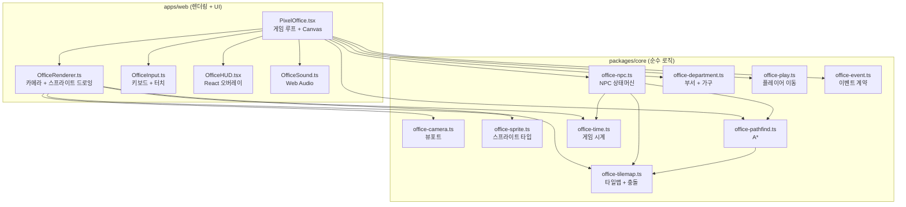

# Pixel Office Expansion -- Stardew Valley-Style Office Simulation

작성일 2026-07-24. 근거: Phase 16-17 완료 상태(PixelOffice.tsx Canvas 2D, office-play.ts/office-event.ts core)에서
Stardew Valley 스타일 회사 시뮬레이션으로 확장하기 위한 종합 아키텍처 설계.

## 현재 상태 요약

| 항목 | 현재 | 목표 |
|------|------|------|
| 맵 크기 | 15x9 단일 방 | 80x60+ 멀티룸(로비, 복도, 9개 부서, 공용 공간) |
| 렌더링 | Canvas 2D, 절차적 오리(drawDuck) | 스프라이트 시트 기반, 걷기 4방향x4프레임 |
| 카메라 | 없음(맵=뷰포트) | 플레이어 추적 스크롤, 미니맵 |
| 입력 | 키보드 전용(Arrow/WASD + E) | 키보드 + 모바일 터치(가상 D-pad, 탭 상호작용) |
| NPC | 3~6명 고정 위치, 랜덤 상태 | 부서별 NPC, 스케줄(출근/점심/퇴근), A* 경로탐색 |
| 역할 | plan/do/check/boss (PDCA) | 9개 부서 + CEO |
| 시간 | 없음 | 게임 시계, 주/야간 팔레트 |
| 사운드 | 없음 | BGM + SFX (Web Audio API) |
| 이벤트 | 시뮬레이터 랜덤 | Claude Code hooks 실이벤트 (Tauri) |

## 의존 방향 변경 없음

확장 후에도 import 규칙 유지:
```
apps/web -> packages/ui, packages/core
packages/core는 아무것도 import하지 않음
```

모든 게임 로직(타일맵, 경로탐색, NPC 상태머신, 시간 시스템)은 `packages/core/src/domain/` 순수함수.
렌더링은 `apps/web/src/components/` React + Canvas 2D.

---

## 아키텍처 다이어그램

```
                    apps/web/src/components/
                    +-----------------------+
                    |   PixelOffice.tsx      | -- 진입점, Canvas mount, 게임 루프
                    |   OfficeRenderer.ts    | -- 렌더링 전용 (카메라, 스프라이트, 조명)
                    |   OfficeInput.ts       | -- 키보드 + 터치 입력 추상화
                    |   OfficeHUD.tsx        | -- React 오버레이 (대화, 대시보드, 미니맵)
                    |   OfficeSound.ts       | -- Web Audio BGM/SFX
                    +-----------+-----------+
                                |
                    imports (타입, 순수함수)
                                |
                    packages/core/src/domain/
                    +-----------------------+
                    |  office-tilemap.ts     | -- TileMap, TileType, collision, zones
                    |  office-camera.ts      | -- viewport follow, clamp, lerp
                    |  office-sprite.ts      | -- SpriteSheet, AnimFrame 타입
                    |  office-npc.ts         | -- NPC state machine, schedule
                    |  office-pathfind.ts    | -- A* on tilemap
                    |  office-department.ts  | -- 부서 정의, 가구, NPC 배치
                    |  office-time.ts        | -- 게임 시계, 주야간, 팔레트
                    |  office-play.ts        | -- [기존] movePlayer, isAdjacent, etc.
                    |  office-event.ts       | -- [기존] 이벤트 계약, eventToState
                    +-----------------------+
```



---

## Phase A: 타일맵 기반 (Tilemap Foundation)

**목표**: 15x9 하드코딩 단일 방을 타일맵 데이터 구조로 교체. 카메라 뷰포트로 큰 맵의 일부만 렌더링.
맵 크기를 80x60으로 확장해 멀티룸 레이아웃의 기반을 놓는다.

**CODE-COMPLETABLE**: 전부. 외부 에셋/인프라 불필요.

### T-A1: 타일맵 데이터 구조 (Complexity: M)

**구현**: 2D 배열 기반 타일맵. 각 타일은 숫자 ID(바이트 수준). 타일 종류 enum으로 floor, wall,
desk, door, decoration 등 구분. 충돌은 타일 타입에서 파생(wall/desk = blocked).

**파일 생성**:
- `packages/core/src/domain/office-tilemap.ts`
- `packages/core/src/domain/office-tilemap.test.ts`

**핵심 타입**:
```typescript
// 타일 종류. 숫자 enum으로 맵 데이터 직렬화 경량화.
export const enum TileType {
  Floor       = 0,
  Wall        = 1,
  Desk        = 2,
  Chair       = 3,
  Door        = 4,
  Corridor    = 5,
  Carpet      = 6,  // 부서별 색상 맵핑
  Table       = 7,  // 회의실/식당 테이블
  Plant       = 8,
  Bookshelf   = 9,
  CoffeeMachine = 10,
  Whiteboard  = 11,
  Server      = 12,
  Reception   = 13,
}

export type TileMap = {
  cols: number;
  rows: number;
  tiles: Uint8Array;        // cols * rows, row-major
  zones: Zone[];            // 방/구역 메타
};

export type Zone = {
  id: string;               // "engineering", "ceo-office", "lobby"
  label: string;            // "개발팀", "사장실", "로비"
  department?: DepartmentId;
  bounds: { x: number; y: number; w: number; h: number };
};

// 타일 접근 순수함수
export function getTile(map: TileMap, x: number, y: number): TileType;
export function setTile(map: TileMap, x: number, y: number, t: TileType): void;
export function isSolid(t: TileType): boolean;
export function isBlocked(map: TileMap, x: number, y: number): boolean;
export function getZoneAt(map: TileMap, x: number, y: number): Zone | undefined;
```

**의존**: 없음 (새 모듈)
**파급**: office-play.ts의 `isBlocked` 콜백이 이 함수를 사용하도록 변경

### T-A2: 카메라 뷰포트 시스템 (Complexity: M)

**구현**: 플레이어 위치를 따라가는 2D 뷰포트. lerp로 부드러운 추적. 맵 경계 클램프.
뷰포트 크기는 캔버스 크기에서 결정(480x288 기존 유지 가능, 나중에 반응형 확장).

**파일 생성**:
- `packages/core/src/domain/office-camera.ts`
- `packages/core/src/domain/office-camera.test.ts`

**핵심 타입**:
```typescript
export type Camera = {
  x: number;          // 뷰포트 좌상단 월드 좌표 (px)
  y: number;
  viewW: number;      // 뷰포트 크기 (px)
  viewH: number;
};

// 플레이어 추적. lerp 0~1 (0=즉시 없음, 1=즉시 스냅, 0.08~0.12 권장)
export function followTarget(
  cam: Camera,
  targetX: number, targetY: number,
  mapW: number, mapH: number,
  lerp: number,
): Camera;

// 월드좌표 -> 스크린좌표 변환
export function worldToScreen(cam: Camera, wx: number, wy: number): Vec;
// 스크린좌표 -> 월드좌표 (터치 입력 역변환)
export function screenToWorld(cam: Camera, sx: number, sy: number): Vec;
// 뷰포트에 보이는 타일 범위 (렌더 최적화 — 보이는 타일만 그리기)
export function visibleTileRange(cam: Camera, tileSize: number): {
  minCol: number; maxCol: number; minRow: number; maxRow: number;
};
```

**의존**: T-A1 (맵 크기 참조)
**파급**: PixelOffice.tsx 렌더링 전면 수정

### T-A3: 맵 빌더 유틸 + 초기 80x60 맵 (Complexity: L)

**구현**: 코드로 맵을 조립하는 빌더 함수. JSON 맵 에디터는 사용하지 않는다(추가 의존성 회피).
방을 사각형으로 정의하고 벽/문/복도를 절차적으로 채우는 빌더.

**파일 생성**:
- `packages/core/src/domain/office-map-builder.ts`
- `packages/core/src/domain/office-map-builder.test.ts`

**핵심 함수**:
```typescript
// 사각형 방 찍기. 내부를 floor, 테두리를 wall, 지정 위치에 door.
export function stampRoom(
  map: TileMap,
  x: number, y: number, w: number, h: number,
  doors: Vec[],
  zone: Zone,
): void;

// 두 방 사이 복도 연결 (수평/수직/L자)
export function connectRooms(
  map: TileMap,
  from: Vec, to: Vec, width: number,
): void;

// 전체 오피스 맵 생성 (80x60 기본)
export function buildOfficeMap(): TileMap;
```

**의존**: T-A1
**파급**: PixelOffice.tsx가 buildOfficeMap()으로 맵 생성

### T-A4: PixelOffice.tsx 카메라 통합 (Complexity: M)

**구현**: 기존 `drawFloor` 직접 그리기를 카메라 기반 렌더로 교체.
`visibleTileRange`로 보이는 타일만 순회, `worldToScreen`으로 좌표 변환.
기존 15x9 바닥 체커보드를 타일 타입별 색상으로 교체.

**파일 수정**:
- `apps/web/src/components/PixelOffice.tsx`

**의존**: T-A1, T-A2, T-A3
**파급**: 모든 후속 Phase가 이 렌더 파이프라인 위에 구축

### T-A5: office-play.ts movePlayer 통합 (Complexity: S)

**구현**: 기존 `movePlayer`의 `isBlocked` 콜백을 `office-tilemap.isBlocked`로 연결.
외부 API 변경 없음(콜백 시그니처 유지). 기존 테스트 그대로 통과.

**파일 수정**:
- `apps/web/src/components/PixelOffice.tsx` (isBlocked 콜백 재바인딩)

**의존**: T-A1, T-A4

---

## Phase B: 스프라이트 시스템 (Sprite System)

**목표**: 절차적 `drawDuck`을 스프라이트 시트 기반으로 교체. 4방향 걷기 애니메이션,
상태별 포즈, 부서별 색상 변주. 가구/장식도 스프라이트.

**CODE-COMPLETABLE**: 스프라이트 로더, 애니메이션 시스템, placeholder 드로잉은 코드로 완결.
**NEEDS ASSETS**: 실제 픽셀아트 스프라이트 시트(PNG). placeholder로 절차적 드로잉을 유지하다가
에셋이 준비되면 교체 가능하도록 추상화.

### T-B1: 스프라이트 시트 타입 + 로더 (Complexity: M)

**파일 생성**:
- `packages/core/src/domain/office-sprite.ts` (타입만, HTMLImageElement 참조 없음)
- `apps/web/src/lib/sprite-loader.ts` (브라우저 Image 로딩)

**핵심 타입**:
```typescript
// core: 플랫폼 무관 타입
export type SpriteFrame = {
  sx: number; sy: number;  // 시트 내 소스 좌표
  sw: number; sh: number;  // 소스 크기
};

export type SpriteAnimation = {
  frames: SpriteFrame[];
  frameDuration: number;    // ms per frame
  loop: boolean;
};

export type SpriteSheet = {
  id: string;
  frameW: number;
  frameH: number;
  animations: Record<string, SpriteAnimation>;
};

// 프레임 인덱스 계산 (순수함수)
export function currentFrame(anim: SpriteAnimation, elapsedMs: number): SpriteFrame;
```

```typescript
// web: 브라우저 로더
export async function loadSpriteSheet(
  src: string, sheet: SpriteSheet
): Promise<{ image: HTMLImageElement; sheet: SpriteSheet }>;
```

**의존**: 없음

### T-B2: 오리 걷기 애니메이션 정의 (Complexity: M)

**구현**: 4방향(up/down/left/right) x 4프레임 걷기 사이클.
6개 상태(idle/typing/reading/server/question/offwork) 포즈.
부서별 색상 팔레트(모자/넥타이 색상 변주 — 팔레트 스왑).

**파일 생성**:
- `packages/core/src/domain/office-duck-anim.ts`

**핵심 타입**:
```typescript
export type DuckDirection = "up" | "down" | "left" | "right";

export type DuckAnimKey =
  | `walk-${DuckDirection}`
  | `idle-${DuckDirection}`
  | DuckWorkState;           // typing, reading, server, question, offwork

// 부서별 팔레트 오프셋 (스프라이트 시트에서 행 오프셋)
export type DuckVariant = {
  department: DepartmentId;
  paletteRow: number;         // 스프라이트 시트 Y 오프셋 행
};

export function duckAnimKey(state: DuckWorkState, dir: DuckDirection, isMoving: boolean): DuckAnimKey;
```

**의존**: T-B1, office-event.ts (DuckWorkState)

### T-B3: 절차적 폴백 + 스프라이트 전환 렌더러 (Complexity: M)

**구현**: 스프라이트가 로드되면 drawImage, 아니면 기존 drawDuck 폴백.
OfficeRenderer가 이 분기를 캡슐화. PixelOffice.tsx에서 drawDuck 직접 호출 제거.

**파일 생성**:
- `apps/web/src/lib/office-renderer.ts`

**핵심 함수**:
```typescript
export class OfficeRenderer {
  constructor(ctx: CanvasRenderingContext2D, tileSize: number);

  // 스프라이트 시트 등록 (에셋 준비 후)
  registerSheet(id: string, image: HTMLImageElement, sheet: SpriteSheet): void;

  // 타일맵 렌더 (카메라 적용)
  drawTilemap(map: TileMap, camera: Camera): void;

  // 오리 렌더 (스프라이트 or 폴백)
  drawDuck(
    worldX: number, worldY: number,
    animKey: DuckAnimKey, elapsedMs: number,
    variant?: DuckVariant, isBoss?: boolean,
  ): void;

  // 가구 렌더
  drawFurniture(worldX: number, worldY: number, type: TileType): void;

  // 일괄 그리기 순서 (바닥 -> 가구 -> 캐릭터 -> HUD)
  beginFrame(camera: Camera): void;
  endFrame(): void;
}
```

**의존**: T-A2 (Camera), T-B1, T-B2
**파급**: PixelOffice.tsx의 tick() 함수 구조 변경

### T-B4: 가구/장식 타일 렌더링 (Complexity: S)

**구현**: TileType별 절차적 가구 드로잉 함수. 책상, 의자, 화분, 커피머신, 화이트보드,
서버랙, 책장 등. 나중에 스프라이트로 교체 가능.

**파일 수정**:
- `apps/web/src/lib/office-renderer.ts` (drawFurniture 구현)

**의존**: T-A1 (TileType), T-B3

---

## Phase C: 모바일 터치 컨트롤 (Mobile Controls)

**목표**: 모바일 브라우저에서 터치로 플레이. 가상 D-pad, 탭 상호작용.

**CODE-COMPLETABLE**: 전부. 순수 DOM/Canvas 이벤트.

### T-C1: 입력 추상화 레이어 (Complexity: M)

**구현**: 키보드와 터치를 통합하는 입력 시스템. 현재 PixelOffice.tsx의 onKeyDown을
InputManager로 분리. 매 프레임 폴링 방식(현재 키 상태 조회).

**파일 생성**:
- `apps/web/src/lib/office-input.ts`

**핵심 타입**:
```typescript
export type InputAction = "up" | "down" | "left" | "right" | "interact" | "menu" | "cancel";

export class InputManager {
  // 키보드 이벤트 핸들러 등록
  bindKeyboard(element: HTMLElement): () => void;
  // 터치 이벤트 핸들러 등록 (D-pad 영역)
  bindTouch(canvas: HTMLCanvasElement, dpadArea: DOMRect): () => void;

  // 매 프레임 조회
  isPressed(action: InputAction): boolean;
  isJustPressed(action: InputAction): boolean; // 이번 프레임에 처음 눌림
  consumeJustPressed(action: InputAction): boolean;

  // 터치 탭 위치 (상호작용 대상 판별용)
  lastTapWorld(): Vec | null;

  // 프레임 끝에 호출
  endFrame(): void;
}
```

**의존**: 없음
**파급**: PixelOffice.tsx onKeyDown 리팩터링

### T-C2: 가상 D-pad 오버레이 (Complexity: M)

**구현**: Canvas 위에 React로 투명 D-pad 버튼 4개 + 상호작용(A) 버튼 오버레이.
터치 시작/끝 이벤트를 InputManager에 전달. 키보드가 감지되면 자동 숨김.
CSS `pointer-events` + `touch-action: none`으로 캔버스 스크롤 방지.

**파일 생성**:
- `apps/web/src/components/VirtualDpad.tsx`

**핵심 구조**:
```typescript
export function VirtualDpad({ input }: { input: InputManager }) {
  // 좌측: 방향 D-pad (4버튼 십자)
  // 우측: A 버튼 (상호작용)
  // 터치 중 반복 이동 (150ms 간격)
  // 데스크톱 hover 시 opacity 30%, 터치 디바이스에서만 opacity 100%
}
```

**의존**: T-C1

### T-C3: 탭-투-인터랙트 (Complexity: S)

**구현**: NPC를 직접 탭하면 상호작용 (E키 대체). screenToWorld로 탭 위치를
월드 좌표로 변환 후 인접 NPC 탐색. 인접하지 않으면 플레이어를 해당 NPC
옆으로 이동시킨 뒤 자동 상호작용 (pathfind 연동은 Phase E 이후).

**파일 수정**:
- `apps/web/src/components/PixelOffice.tsx`

**의존**: T-C1, T-A2 (screenToWorld)

### T-C4: 반응형 캔버스 크기 (Complexity: S)

**구현**: 현재 고정 480x288을 컨테이너 크기에 반응하도록 변경.
ResizeObserver로 캔버스 크기 갱신, 카메라 viewW/viewH 동적 조정.
최소 320x240, 최대 960x576 (TILE=32 기준).

**파일 수정**:
- `apps/web/src/components/PixelOffice.tsx`

**의존**: T-A2 (Camera)

---

## Phase D: 오피스 레이아웃 + 부서 (Office Layout & Departments)

**목표**: 9개 부서, 사장실, 공용공간을 갖춘 실제 회사 오피스 맵.

**CODE-COMPLETABLE**: 맵 데이터, 부서 정의, 가구 배치 전부 코드. 스프라이트는 Phase B 폴백 사용.

### T-D1: 부서 정의 (Complexity: S)

**파일 생성**:
- `packages/core/src/domain/office-department.ts`
- `packages/core/src/domain/office-department.test.ts`

**핵심 타입**:
```typescript
export const DEPARTMENTS = [
  "engineering",    // 개발
  "marketing",      // 마케팅
  "design",         // 디자인
  "hr",             // 인사
  "finance",        // 재무
  "sales",          // 영업
  "support",        // 고객지원
  "qa",             // QA
  "operations",     // 운영
] as const;

export type DepartmentId = typeof DEPARTMENTS[number];

export type Department = {
  id: DepartmentId;
  label: string;           // "개발팀"
  labelEn: string;         // "Engineering"
  color: string;           // 부서 테마 색 (카펫, 이름표)
  icon: string;            // 이모지 아이콘
  defaultHeadcount: number;
  furnitureSet: TileType[]; // 부서별 고유 가구
};

export const DEPARTMENT_REGISTRY: Record<DepartmentId, Department>;

// 사장실, 로비, 식당, 회의실 등 공용 구역
export const COMMON_ZONES = [
  "ceo-office",    // 사장실
  "lobby",         // 로비/리셉션
  "cafeteria",     // 식당/휴게실
  "meeting-room",  // 회의실
  "server-room",   // 서버실
  "corridor",      // 복도
] as const;

export type CommonZoneId = typeof COMMON_ZONES[number];
```

**의존**: T-A1 (TileType)

### T-D2: 오피스 플로어플랜 (Complexity: L)

**구현**: 80x60 타일 맵의 구체적 레이아웃. buildOfficeMap()의 실제 구현.

```
플로어플랜 (80x60 타일, 1타일=32px → 2560x1920px 월드)

         0        10       20       30       40       50       60       70     79
    0  +--------+--------+--------+--------+--------+--------+--------+--------+
       |                              로비 (Lobby)                              |
       |           리셉션데스크          화분    화분         소파               |
    6  +--------+----+---+--------+---+----+--------+--------+--------+--------+
       |             |              복도                      |                 |
    8  + 사장실(CEO) +   +--------+--------+--------+--------+  회의실          +
       | 대형 책상   |   |  개발  |  디자인 |   QA   | 마케팅 |  대형 테이블    |
       | 소파, 화분  +   | (Eng)  | (Dsgn)  |  (QA)  | (Mkt)  +                 +
   14  |             | 복|  6석   |  4석    |  4석   |  4석   |                 |
       +--------+----+ 도+--------+--------+--------+--------+--------+--------+
   16  |             |   |                                    |                 |
       |  인사 (HR)  |   |              식당 / 휴게실          |  영업 (Sales)   |
       |    3석      |   |  테이블x4  커피머신  자판기         |    4석          |
   22  +--------+----+   +--------+--------+--------+--------+----+--------+  +
   24  |             | 복|  재무   |  운영   | 고객지원         |                |
       |  서버실     | 도| (Fin)  | (Ops)  | (Support)        |                |
       |  서버랙x4   |   |  3석   |  3석   |   4석            |                |
   30  +--------+----+---+--------+--------+--------+---------+--------+-------+

(대략적 비율. 실제 구현 시 stampRoom 좌표로 정밀 배치)
```

**파일 수정**:
- `packages/core/src/domain/office-map-builder.ts` (buildOfficeMap 구현)

**의존**: T-A1, T-A3, T-D1

### T-D3: 부서별 가구 배치 (Complexity: M)

**구현**: 각 부서 방 안에 부서 특성에 맞는 가구 배치.
- Engineering: 모니터 2대 책상, 서버랙
- Design: 큰 모니터, 드로잉 태블릿(장식)
- QA: 테스트 머신, 버그 보드(화이트보드)
- Marketing: 프레젠테이션 스크린
- Finance: 서류 캐비닛, 계산기
- HR: 면접 소파, 서류함
- Sales: 전화기, 차트 보드
- Support: 헤드셋, 다중 모니터
- Operations: 대시보드 스크린

**파일 수정**:
- `packages/core/src/domain/office-map-builder.ts` (furnishRoom 함수)

**의존**: T-D1, T-D2

### T-D4: 방 전환 + 문 시스템 (Complexity: S)

**구현**: Door 타일 위를 걸으면 zone 전환. zone 이름 HUD 표시.
문은 양방향 통과 가능 (충돌 없음). 문 타일 위에 서면 현재 zone이 변경.

**파일 수정**:
- `packages/core/src/domain/office-tilemap.ts` (getDoorTarget)
- `apps/web/src/components/PixelOffice.tsx` (zone 표시 HUD)

**의존**: T-A1, T-D2

---

## Phase E: NPC 행동 시스템 (NPC Behavior)

**목표**: NPC 오리들이 스케줄에 따라 출근, 근무, 점심, 퇴근하고 자리에서 일하며
가끔 커피를 마시러 가거나 동료와 잡담.

**CODE-COMPLETABLE**: 전부. 순수 로직.

### T-E1: 게임 시계 (Complexity: S)

**파일 생성**:
- `packages/core/src/domain/office-time.ts`
- `packages/core/src/domain/office-time.test.ts`

**핵심 타입**:
```typescript
export type GameClock = {
  hour: number;       // 0~23
  minute: number;     // 0~59
  dayOfWeek: number;  // 0=월 ~ 6=일
  speed: number;      // 실시간 1초 = 게임 N분 (기본 1초=1분 → 24분=하루)
  paused: boolean;
};

export function tickClock(clock: GameClock, deltaMs: number): GameClock;
export function formatTime(clock: GameClock): string;  // "09:30"
export function timeOfDay(clock: GameClock): "dawn" | "morning" | "afternoon" | "evening" | "night";
export function isWorkHour(clock: GameClock): boolean;  // 9:00~18:00
export function isLunchHour(clock: GameClock): boolean;  // 12:00~13:00
```

**의존**: 없음

### T-E2: NPC 상태머신 (Complexity: L)

**파일 생성**:
- `packages/core/src/domain/office-npc.ts`
- `packages/core/src/domain/office-npc.test.ts`

**핵심 타입**:
```typescript
export type NpcState =
  | "commuting-in"    // 출근 중 (로비 → 자기 자리)
  | "working"         // 자리에서 근무 (typing/reading 등)
  | "idle"            // 잠시 스트레칭/멍
  | "coffee-break"    // 커피머신으로 이동 → 복귀
  | "lunch"           // 식당으로 이동 → 식사 → 복귀
  | "meeting"         // 회의실로 이동 → 회의 → 복귀
  | "chatting"        // 인접 동료와 잡담
  | "commuting-out"   // 퇴근 중 (자기 자리 → 로비 → 소멸)
  | "offwork";        // 퇴근 완료 (렌더 안 함)

export type Npc = {
  id: string;
  name: string;              // "오리 1호", "김개발"
  department: DepartmentId;
  deskTile: Vec;             // 지정 좌석
  currentTile: Vec;          // 현재 위치
  state: NpcState;
  prevState: NpcState;
  workState: DuckWorkState;  // 자리에서 일할 때 세부 상태
  path: Vec[];               // A* 경로 (이동 중)
  pathIndex: number;
  stateTimer: number;        // 현재 상태 경과 ms
  mood: number;              // 0~100 (향후 상호작용)
  schedule: NpcScheduleEntry[];
};

export type NpcScheduleEntry = {
  hour: number;
  minute: number;
  action: NpcState;
  target?: Vec;              // 이동 목표 (lunch → 식당 좌석 등)
};

// 기본 스케줄 생성 (부서별 약간의 변주)
export function defaultSchedule(dept: DepartmentId): NpcScheduleEntry[];

// 매 틱 상태 전이
export function tickNpc(
  npc: Npc,
  clock: GameClock,
  map: TileMap,
  deltaMs: number,
  findPath: (from: Vec, to: Vec) => Vec[],
): Npc;
```

**의존**: T-E1, T-A1 (TileMap), office-event.ts (DuckWorkState)

### T-E3: A* 경로탐색 (Complexity: M)

**파일 생성**:
- `packages/core/src/domain/office-pathfind.ts`
- `packages/core/src/domain/office-pathfind.test.ts`

**핵심 함수**:
```typescript
// 4방향 A* (대각 이동 없음, 기존 movePlayer와 일관)
// 반환: 시작~끝 경로 Vec[] (시작 포함, 끝 포함). 경로 없으면 빈 배열.
// maxSteps: 탐색 상한 (성능 보호, 기본 500)
export function findPath(
  map: TileMap,
  from: Vec,
  to: Vec,
  maxSteps?: number,
  isOccupied?: (x: number, y: number) => boolean,  // 다른 NPC 회피 (선택)
): Vec[];

// 맨해튼 거리 휴리스틱
export function manhattan(a: Vec, b: Vec): number;
```

**의존**: T-A1 (TileMap, isBlocked)

### T-E4: NPC 매니저 + 게임루프 통합 (Complexity: M)

**구현**: 모든 NPC를 일괄 관리하는 매니저. 매 프레임 tickNpc를 호출하고
이동 중인 NPC의 보간 위치를 계산(렌더용).

**파일 생성**:
- `packages/core/src/domain/office-npc-manager.ts`

**핵심 함수**:
```typescript
export type NpcManager = {
  npcs: Npc[];
  clock: GameClock;
};

// 부서 인원 수 기반으로 NPC 생성
export function createNpcTeam(departments: Department[], map: TileMap): Npc[];

// 매 프레임 전체 NPC 틱
export function tickAllNpcs(
  manager: NpcManager,
  map: TileMap,
  deltaMs: number,
): NpcManager;

// 렌더용: NPC의 보간된 월드 좌표 (타일 사이 부드러운 이동)
export function npcWorldPos(npc: Npc, tileSize: number, moveProgress: number): Vec;
```

**의존**: T-E1, T-E2, T-E3
**파급**: PixelOffice.tsx 게임 루프에 NPC 틱 추가

---

## Phase F: CEO 상호작용 시스템 (CEO Interaction)

**목표**: 사장(CEO) 오리가 직원과 대화하고 부서 현황을 파악하는 게임플레이.

**CODE-COMPLETABLE**: 전부.

### T-F1: 대화 시스템 (Complexity: M)

**구현**: NPC 옆에서 상호작용하면 대화 버블. 기존 describeActivity를 확장해
NPC 상태, 기분, 부서에 따른 다양한 대사. LLM 없이 템플릿 기반.

**파일 생성**:
- `packages/core/src/domain/office-dialog.ts`
- `packages/core/src/domain/office-dialog.test.ts`

**핵심 타입**:
```typescript
export type DialogLine = {
  speaker: string;       // NPC 이름
  text: string;          // 대사
  mood: "happy" | "neutral" | "stressed" | "tired";
};

// NPC 상태 기반 대사 생성 (템플릿 풀에서 랜덤 선택)
export function generateDialog(npc: Npc, clock: GameClock): DialogLine;

// 부서 인사말 (방에 들어갈 때)
export function departmentGreeting(dept: DepartmentId, clock: GameClock): string;
```

**의존**: T-E2 (Npc), T-E1 (GameClock)

### T-F2: 대화 버블 렌더링 (Complexity: S)

**구현**: 캔버스 위에 말풍선 그리기. 둥근 사각형 + 꼬리.
여러 줄 텍스트, 자동 줄바꿈. 3초 후 자동 닫힘 또는 탭/키로 닫기.

**파일 수정**:
- `apps/web/src/lib/office-renderer.ts` (drawBubble 메서드)

**의존**: T-B3

### T-F3: 부서 상태 대시보드 (Complexity: M)

**구현**: 사장실 책상에서 상호작용하면 전체 부서 현황 패널.
부서별 인원, 현재 출근/점심/퇴근 수, 평균 기분, 진행 중 작업 요약.
React 오버레이 (OfficeHUD).

**파일 생성**:
- `apps/web/src/components/OfficeDashboard.tsx`

**의존**: T-D1, T-E4 (NpcManager)

### T-F4: 직원 기분/생산성 표시기 (Complexity: S)

**구현**: NPC 머리 위에 기분 아이콘 (작은 이모지 또는 색상 점).
mood 0~30 빨강, 30~70 노랑, 70~100 초록. 사장이 말을 걸면 기분 +5.

**파일 수정**:
- `apps/web/src/lib/office-renderer.ts` (drawMoodIndicator)
- `packages/core/src/domain/office-npc.ts` (mood 변경 로직)

**의존**: T-E2, T-B3

---

## Phase G: 주야간 + 시각 연출 (Day/Night & Visual Polish)

**목표**: 시간에 따른 조명 변화, 미니맵.

**CODE-COMPLETABLE**: 전부.

### T-G1: 주야간 팔레트 시프트 (Complexity: M)

**구현**: timeOfDay에 따라 전체 화면에 색조 오버레이.
dawn(파랑-보라 틴트), morning(밝은 자연광), afternoon(따뜻한 노랑),
evening(주황 석양), night(진한 파랑, 창문만 밝음).
globalCompositeOperation으로 색 오버레이 레이어.

**파일 수정**:
- `apps/web/src/lib/office-renderer.ts` (drawLightingOverlay)

**핵심 구현**:
```typescript
export type LightingPalette = {
  overlay: string;       // rgba 색상
  opacity: number;       // 0~0.4
  windowGlow: boolean;   // 야간 창문 빛
};

export function getLightingForTime(tod: TimeOfDay): LightingPalette;
```

**의존**: T-E1 (timeOfDay)

### T-G2: 미니맵 (Complexity: M)

**구현**: 화면 우상단에 작은 미니맵. 전체 맵을 축소 렌더(1타일=1~2px).
플레이어 위치 빨간 점, NPC 위치 작은 점(부서 색상), 뷰포트 사각형.
별도 작은 Canvas 또는 메인 Canvas 위에 오프스크린 버퍼로 그리기.

**파일 생성**:
- `apps/web/src/components/OfficeMinimap.tsx`

**핵심 구조**:
```typescript
export function OfficeMinimap({
  map, camera, playerTile, npcs, size
}: {
  map: TileMap;
  camera: Camera;
  playerTile: Vec;
  npcs: Npc[];
  size: number;  // 미니맵 px 크기 (예: 120)
}) {
  // 별도 canvas ref, 타일 1px 단위로 축소 렌더
  // 부서 색상으로 zone 표시
  // 클릭하면 해당 위치로 카메라 점프 (CEO 이동은 아님)
}
```

**의존**: T-A1, T-A2, T-D1, T-E4

### T-G3: 부드러운 이동 보간 (Complexity: S)

**구현**: 현재 플레이어는 그리드 스냅 이동. 타일 간 보간(lerp)으로
부드러운 걷기 연출. 이동 시작 시 목표 타일 설정, 150ms 동안 선형 보간.
보간 중 추가 입력은 큐에 넣거나 무시.

**파일 수정**:
- `apps/web/src/components/PixelOffice.tsx` (플레이어 이동 보간)
- `packages/core/src/domain/office-play.ts` (MoveState 타입 추가)

**핵심 타입**:
```typescript
export type MoveState = {
  from: Vec;
  to: Vec;
  progress: number;    // 0~1
  duration: number;    // ms
};

export function lerpMove(state: MoveState, deltaMs: number): MoveState;
export function moveWorldPos(state: MoveState, tileSize: number): Vec;
```

**의존**: T-A4

---

## Phase H: 사운드 (Sound)

**목표**: 오피스 분위기를 살리는 BGM과 SFX.

**CODE-COMPLETABLE**: Web Audio API 시스템, 사운드 재생 로직 전부 코드.
**NEEDS ASSETS**: 실제 오디오 파일 (OGG/MP3). 프리 라이선스 에셋 또는 자체 제작.

### T-H1: 사운드 매니저 (Complexity: M)

**파일 생성**:
- `apps/web/src/lib/office-sound.ts`

**핵심 구조**:
```typescript
export type SoundId =
  | "bgm-office"         // lo-fi 오피스 앰비언스
  | "sfx-footstep"       // 발걸음
  | "sfx-typing"         // 타이핑
  | "sfx-door"           // 문 열기
  | "sfx-coffee"         // 커피 머신
  | "sfx-chat"           // 대화 시작
  | "sfx-notification";  // 이벤트 알림

export class SoundManager {
  private ctx: AudioContext | null = null;
  private sounds: Map<SoundId, AudioBuffer>;
  private bgmGain: GainNode;
  private sfxGain: GainNode;

  // 사용자 제스처 후 초기화 (브라우저 autoplay 정책)
  async init(): Promise<void>;

  // 에셋 로드
  async load(id: SoundId, url: string): Promise<void>;

  // BGM 루프 재생/정지
  playBgm(id: SoundId): void;
  stopBgm(): void;

  // SFX 원샷
  playSfx(id: SoundId): void;

  // 볼륨 (0~1)
  setBgmVolume(v: number): void;
  setSfxVolume(v: number): void;

  // 음소거 토글 (UI 버튼)
  toggleMute(): boolean;

  // 정리
  dispose(): void;
}
```

**의존**: 없음

### T-H2: 사운드 트리거 연결 (Complexity: S)

**구현**: 게임 이벤트에 사운드 트리거 연결.
- 플레이어 이동 → sfx-footstep (이동 시마다, 쿨다운 200ms)
- NPC 타이핑 상태 → sfx-typing (자리 근처 지나갈 때만, 거리 감쇠)
- 문 통과 → sfx-door
- 대화 시작 → sfx-chat
- 이벤트 도착 → sfx-notification

**파일 수정**:
- `apps/web/src/components/PixelOffice.tsx` (사운드 트리거 호출)

**의존**: T-H1

### T-H3: 사운드 설정 UI (Complexity: S)

**구현**: BGM/SFX 볼륨 슬라이더, 음소거 토글.
localStorage에 설정 저장. 초기 진입 시 음소거 상태(autoplay 정책).

**파일 생성**:
- `apps/web/src/components/OfficeSoundControl.tsx`

**의존**: T-H1

---

## Phase I: 실 이벤트 연동 (Real Event Integration)

**목표**: Claude Code의 실제 도구 실행 이벤트를 오피스에 반영.

**CODE-COMPLETABLE**: 이벤트 수신 인터페이스, WebSocket 클라이언트.
**NEEDS INFRASTRUCTURE**: Tauri sidecar (Claude Code hooks JSONL 감시 + WebSocket 서버),
Claude Code 훅 설정.

### T-I1: 이벤트 소스 추상화 (Complexity: S)

**구현**: 시뮬레이터와 실이벤트를 같은 인터페이스로 교체 가능하게.
현재 PixelOffice.tsx의 시뮬레이터를 EventSource 인터페이스로 분리.

**파일 생성**:
- `packages/core/src/domain/office-event-source.ts`

**핵심 타입**:
```typescript
export interface OfficeEventSource {
  subscribe(handler: (event: OfficeEvent) => void): () => void;
  dispose(): void;
}

// 기존 시뮬레이터 추출
export class SimulatorEventSource implements OfficeEventSource {
  constructor(intervalMs: number, errorRate: number);
  subscribe(handler: (event: OfficeEvent) => void): () => void;
  dispose(): void;
}
```

**의존**: office-event.ts

### T-I2: WebSocket 이벤트 소스 (Complexity: M)

**구현**: Tauri sidecar WebSocket에 연결하는 클라이언트.
자동 재접속, 하트비트, officeEventSchema 검증.

**파일 생성**:
- `apps/web/src/lib/ws-event-source.ts`

**핵심 구조**:
```typescript
export class WebSocketEventSource implements OfficeEventSource {
  constructor(url: string, reconnectMs?: number);
  subscribe(handler: (event: OfficeEvent) => void): () => void;
  dispose(): void;
  get connected(): boolean;
}
```

**의존**: T-I1, office-event.ts
**NEEDS**: Tauri sidecar WebSocket 서버 (apps/desktop)

### T-I3: 이벤트 -> NPC 상태 연결 (Complexity: M)

**구현**: 실이벤트의 agentId를 NPC에 매핑. 이벤트가 오면 해당 NPC의
workState를 eventToState로 갱신. 에이전트가 NPC보다 많으면 동적 생성.

**파일 수정**:
- `packages/core/src/domain/office-npc.ts` (이벤트 수신 메서드)
- `apps/web/src/components/PixelOffice.tsx` (EventSource 교체)

**의존**: T-E2, T-I1

---

## 구현 우선순위 + 의존성 그래프

```
Phase A (타일맵 기반) ─────────────────────┐
  T-A1 타일맵 구조                         │
  T-A2 카메라 ← A1                        │
  T-A3 맵 빌더 ← A1                      │
  T-A4 렌더 통합 ← A1,A2,A3              │
  T-A5 movePlayer 통합 ← A1,A4           │
                                           │
Phase B (스프라이트) ← A 완료              │
  T-B1 스프라이트 타입                     │
  T-B2 오리 애니메이션 ← B1               │
  T-B3 렌더러 ← A2,B1,B2                 │
  T-B4 가구 렌더 ← A1,B3                 │
                                           │
Phase C (모바일) ← A 완료 ────────────────┤  C는 B와 병렬 가능
  T-C1 입력 추상화                         │
  T-C2 가상 D-pad ← C1                   │
  T-C3 탭 상호작용 ← C1,A2               │
  T-C4 반응형 캔버스 ← A2                │
                                           │
Phase D (레이아웃) ← A 완료               │
  T-D1 부서 정의 ← A1                    │
  T-D2 플로어플랜 ← A1,A3,D1             │
  T-D3 가구 배치 ← D1,D2                 │
  T-D4 문 시스템 ← A1,D2                 │
                                           │
Phase E (NPC) ← A,D 완료                  │
  T-E1 게임 시계                           │
  T-E2 NPC 상태머신 ← E1,A1              │
  T-E3 A* 경로탐색 ← A1                  │
  T-E4 NPC 매니저 ← E1,E2,E3             │
                                           │
Phase F (CEO 상호작용) ← E 완료           │
  T-F1 대화 시스템 ← E2,E1               │
  T-F2 대화 버블 ← B3                    │
  T-F3 대시보드 ← D1,E4                  │
  T-F4 기분 표시기 ← E2,B3               │
                                           │
Phase G (시각 연출) ← E1,A2,B3            │
  T-G1 주야간 팔레트 ← E1                │
  T-G2 미니맵 ← A1,A2,D1,E4             │
  T-G3 이동 보간 ← A4                    │
                                           │
Phase H (사운드) ← A 완료 ────────────────┤  H는 독립적, 언제든 시작 가능
  T-H1 사운드 매니저                       │
  T-H2 트리거 연결 ← H1                  │
  T-H3 설정 UI ← H1                      │
                                           │
Phase I (실이벤트) ← E 완료               │
  T-I1 이벤트 소스 추상화                  │
  T-I2 WebSocket 소스 ← I1 (Tauri 필요)  │
  T-I3 NPC 연결 ← E2,I1                  │
```

## 병렬 가능 조합

| 병렬 그룹 | 설명 |
|-----------|------|
| B + C + D | Phase A 완료 후, 스프라이트/모바일/레이아웃은 서로 독립 |
| H | 사운드는 Phase A만 있으면 언제든 병렬 |
| G1 + G3 | 주야간과 이동 보간은 서로 독립 |
| T-I1 | 이벤트 추상화는 NPC 없이도 시작 가능 (시뮬레이터 리팩터링) |

## 파일 생성/수정 전체 목록

### 새 파일 (packages/core/src/domain/)

| 파일 | Phase | 설명 |
|------|-------|------|
| office-tilemap.ts (+test) | A | 타일맵 구조, 충돌, zone |
| office-camera.ts (+test) | A | 카메라 뷰포트 |
| office-map-builder.ts (+test) | A | 맵 빌더, 80x60 오피스 |
| office-sprite.ts | B | 스프라이트 시트 타입 |
| office-duck-anim.ts | B | 오리 애니메이션 키 |
| office-department.ts (+test) | D | 부서 정의, 가구 셋 |
| office-time.ts (+test) | E | 게임 시계 |
| office-npc.ts (+test) | E | NPC 상태머신, 스케줄 |
| office-pathfind.ts (+test) | E | A* 경로탐색 |
| office-npc-manager.ts | E | NPC 일괄 관리 |
| office-dialog.ts (+test) | F | 대화 템플릿 |
| office-event-source.ts | I | 이벤트 소스 인터페이스 |

### 새 파일 (apps/web/src/)

| 파일 | Phase | 설명 |
|------|-------|------|
| lib/sprite-loader.ts | B | 브라우저 이미지 로딩 |
| lib/office-renderer.ts | B | 렌더러 클래스 |
| lib/office-input.ts | C | 입력 추상화 |
| lib/office-sound.ts | H | Web Audio 사운드 |
| lib/ws-event-source.ts | I | WebSocket 클라이언트 |
| components/VirtualDpad.tsx | C | 터치 D-pad |
| components/OfficeMinimap.tsx | G | 미니맵 |
| components/OfficeDashboard.tsx | F | 부서 대시보드 |
| components/OfficeSoundControl.tsx | H | 사운드 설정 |

### 수정 파일

| 파일 | Phase | 변경 내용 |
|------|-------|-----------|
| packages/core/src/domain/office-play.ts | A,G | MoveState 추가, isBlocked 연동 |
| packages/core/src/index.ts | A~I | 새 모듈 export 추가 |
| apps/web/src/components/PixelOffice.tsx | A~I | 전면 리팩터링 (단계적) |

## 에셋 목록 (코드 외 필요 자원)

| 에셋 | Phase | 형식 | 비고 |
|------|-------|------|------|
| duck-spritesheet.png | B | PNG 32x32/프레임 | 4방향x4프레임 걷기 + 6상태 포즈 x 9부서 색상 |
| furniture-tiles.png | B | PNG 32x32/타일 | 가구/장식 타일셋 |
| bgm-office.ogg | H | OGG | lo-fi 오피스 앰비언스 BGM (루프) |
| sfx-footstep.ogg | H | OGG | 발걸음 (~100ms) |
| sfx-typing.ogg | H | OGG | 타이핑 (~200ms) |
| sfx-door.ogg | H | OGG | 문 열기 (~300ms) |
| sfx-coffee.ogg | H | OGG | 커피 머신 (~500ms) |
| sfx-chat.ogg | H | OGG | 대화 효과음 (~150ms) |
| sfx-notification.ogg | H | OGG | 알림 (~200ms) |

모든 에셋은 `apps/web/public/office/` 에 배치. 에셋 없이도 절차적 폴백으로 동작.

## 복잡도 요약

| Phase | S | M | L | 합계 | 코드 완결 | 에셋/인프라 필요 |
|-------|---|---|---|------|----------|---------------|
| A 타일맵 | 1 | 2 | 1 | 4 | 전부 | - |
| B 스프라이트 | 1 | 3 | 0 | 4 | 시스템 코드 | PNG 스프라이트 |
| C 모바일 | 2 | 2 | 0 | 4 | 전부 | - |
| D 레이아웃 | 2 | 1 | 1 | 4 | 전부 | - |
| E NPC | 1 | 2 | 1 | 4 | 전부 | - |
| F 상호작용 | 2 | 2 | 0 | 4 | 전부 | - |
| G 시각 | 1 | 2 | 0 | 3 | 전부 | - |
| H 사운드 | 2 | 1 | 0 | 3 | 시스템 코드 | OGG 오디오 |
| I 실이벤트 | 1 | 2 | 0 | 3 | 클라이언트 코드 | Tauri sidecar |
| **합계** | **13** | **17** | **3** | **33** | | |

## 위험 요소 + 대응

| 위험 | 영향 | 대응 |
|------|------|------|
| 80x60 맵의 A* 성능 | NPC 다수 동시 이동 시 프레임 드롭 | maxSteps 상한, 경로 캐시, 경로 재계산 쿨다운 |
| 캔버스 드로콜 폭발 | 타일 4800개 + NPC 30명 → 느림 | visibleTileRange로 가시 영역만 렌더, 오프스크린 타일맵 캐시 |
| 모바일 터치 + 캔버스 스크롤 충돌 | 의도치 않은 페이지 스크롤 | touch-action: none, preventDefault |
| 스프라이트 에셋 미확보 | Phase B 완료 지연 | 절차적 폴백 유지, 에셋은 점진 교체 |
| Tauri sidecar 미구현 | Phase I 실이벤트 불가 | 시뮬레이터 EventSource로 대체, 인터페이스 동일 |
| 게임 루프 + React 상태 동기화 | ref vs state 불일치, 불필요 리렌더 | 게임 상태는 ref, UI 패널만 state |

## PixelOffice.tsx 리팩터링 방향

현재 406줄 단일 파일이 렌더링, 입력, 시뮬레이션, UI를 모두 담당한다.
Phase A부터 단계적으로 분리:

```
현재 PixelOffice.tsx (406줄, 모놀리식)
  ├─ drawFloor, drawDesk, drawDuck  → Phase B: OfficeRenderer
  ├─ onKeyDown, KEY_DIR             → Phase C: InputManager
  ├─ 시뮬레이터 (SIM_TOOLS, rand)   → Phase I: SimulatorEventSource
  ├─ 활동 로그 UI                    → 별도 컴포넌트
  └─ 게임 루프 (tick)                → PixelOffice.tsx에 유지 (오케스트레이터)

리팩터 후 PixelOffice.tsx:
  - Canvas mount + ResizeObserver
  - 게임 루프 (requestAnimationFrame)
  - OfficeRenderer, InputManager, SoundManager, NpcManager 조합
  - React 오버레이 (OfficeHUD) 마운트
  - 약 200줄 목표
```

## 권장 구현 순서

1. **Phase A** (필수 기반) -- 타일맵이 없으면 아무것도 안 됨
2. **Phase D** (레이아웃) -- 맵 위에 방을 배치해야 NPC가 갈 곳이 있음
3. **Phase C** (모바일) -- 모바일 지원은 빠를수록 좋음 (나중에 하면 레이아웃 재조정)
4. **Phase E** (NPC) -- 핵심 게임플레이
5. **Phase B** (스프라이트) -- 에셋 준비와 병렬, 없어도 절차적 폴백으로 진행
6. **Phase F** (상호작용) -- NPC 완료 후
7. **Phase G** (시각) -- 연출. 필수가 아니므로 후순위
8. **Phase H** (사운드) -- 독립적, 에셋만 있으면 언제든
9. **Phase I** (실이벤트) -- Tauri 인프라 의존, 최후순위
